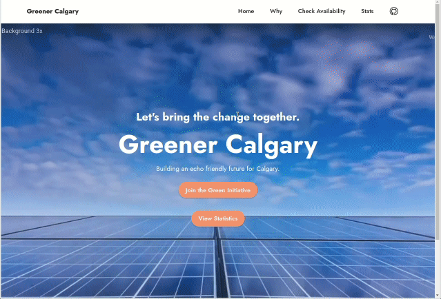
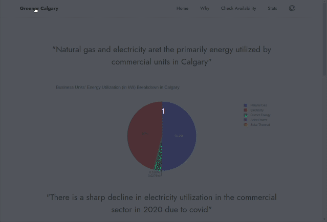
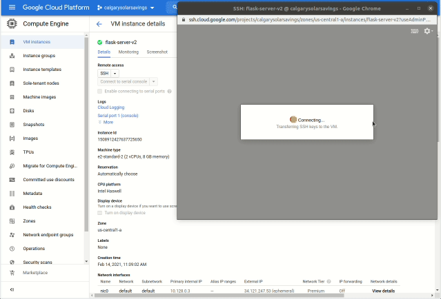

# CalgarySolarSavings
For Hackathon 2021 
To run the server, run `python app.py` from the root folder of the github repo. 

##### Previews

## Inspiration
Calgary is one of the sunniest cities in Canada. Yet, solar power is not used enough. In order to reduce our carbon footprint and transition to a more sustainable future, we have developed a webapp to provide information for homeowners and property managers to encourage the accelerate the adoption of solar power. 
We were inspired by the Solar Map available at the City of Calgary's website: 
* https://maps.calgary.ca/SolarPotential/
## What it does
Our app shows users prediction models forecasting future energy and carbon tax pricing. These models were trained on the following datasets: 
* 
* 
A solar potential map for the entire City of Calgary is rendered to show Owners how much potential energy they could harness. These Solar potential maps were created using the City of Calgary datasets available at the following urls: 
    * https://data.calgary.ca/Environment/Solar-Potential-2012-2013-images-tiff-/yius-inbn
    * https://data.calgary.ca/Environment/Solar-Potential-2012-2017-images-tiff-/5ke3-c93z
    * https://data.calgary.ca/Environment/Solar-Potential-2018-images-tiff-/uc6u-bytb
As a case study, we considered the energy consumption of City of Calgary owned facilities using the dataset found here: 
* https://data.calgary.ca/Environment/Corporate-Energy-Consumption/crbp-innf
 By combining these datasets and synthesizing our analysis, we can inform buildings owners on how to implement solar power on their properties and when they can expect a return on their capital investment into solar. 
## How we built it
The main webapp is built with flask, a Python package.
The front end of the website was prototyped with Mobirise. 
The machine learning/data analysis for energy prices are using Python Arima package.
The plots are using Plotly package for Python.
The solar potential map was converted from 9GB of GeoTiff rasters into a 60 MB embedded html component. Filtering of no-data point was used to create a transparent mask for portions of the map that do not depict roof tops.
The website is hosted on GCP and we used Google Collab notebooks to quickly explore the datasets available to us. 
Github is used extensively to collaborate among 5 developers.

## Challenges we ran into
The main challenge we had to get roof layer to put on top of the map view. The input data was a huge dataset of GeoTiff files. We had never used this format before and it was computationally expensive to manipulate and parse into more friendly formats. Finding the sweet spot in downsampling the input data was critical to rendering a reasonably sized map file. 
Another challenge was forecasting the carbon tax pricing. Since we do not have very much historical data, the forecast may prove to be inaccurate over the long term. However, the overall trend is realistic and will encourage owners to invest in solar power. 
## Accomplishments that we're proud of
Our app looks pretty good and professional! We were proud to develop a full stack website within the time alloted! This was our first time using geospatial data so it was a big hurdle to overcome. 
## What we learned
* How to deploy a website to GCP
* How to create a flask app (for 4/5 of the group members)
* How to parse and interpret GeoTiff raster data
* How to render an html map using folium with a raster overlay
* How to train a ARIMA model for time series extrapolation and prediction.  
## What's next for Greener Calgary
Next steps are:
* Connect solar power installers to our app to give owners a spring board to jump start their upgrade. 
* We hope to connect building owners to by government and industry leaders who are providing green power incentives such as the HSBC Green Loan program.
